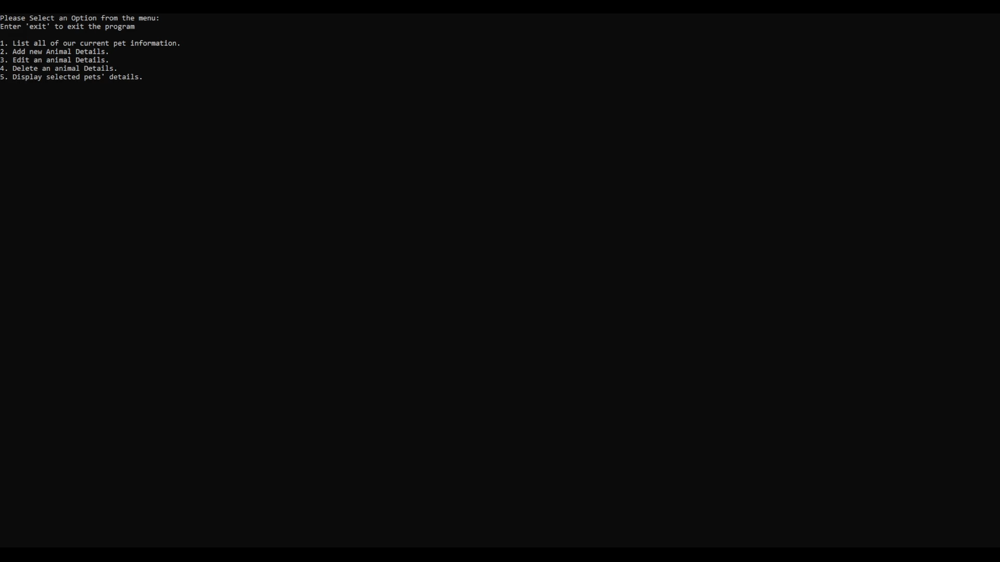

# Pet Management Console Application

## Overview

This console application is designed to manage information about pets simply and intuitively. It allows users to perform various actions, including listing all current pet information, adding new pet details, editing existing pet details, and deleting pet information. The application is built in C# and demonstrates the use of basic console-based interactions for managing a list of animals.

## Features

1. **List All Pets:** View details of all pets currently stored in the system.

2. **Add New Pet Details:** Add information about a new pet, including species, age, physical condition, personality, and nickname.

3. **Edit Pet Details:** Modify information about an existing pet by providing the pet's ID and updating relevant details.

4. **Delete Pet Details:** Remove a pet from the system by specifying the pet's ID.
   
5. **Selected Pet Details**  View details of selected pets currently stored in the system.

## How to Use

1. Clone this repository to your local machine.
2. Open the solution in your preferred C# development environment.
3. Run the application and follow the on-screen menu to interact with the pet management system.

## License

This project is licensed under the [MIT License](LICENSE).

## Screenshot

